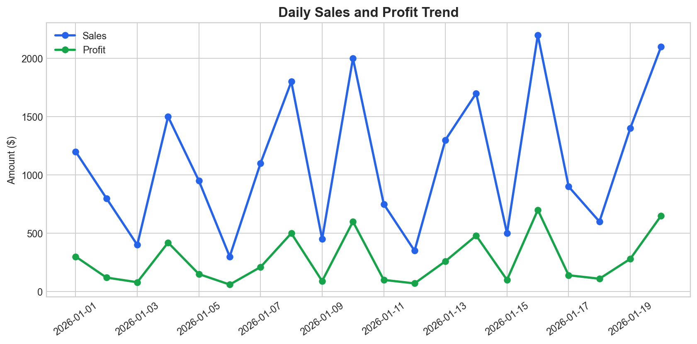
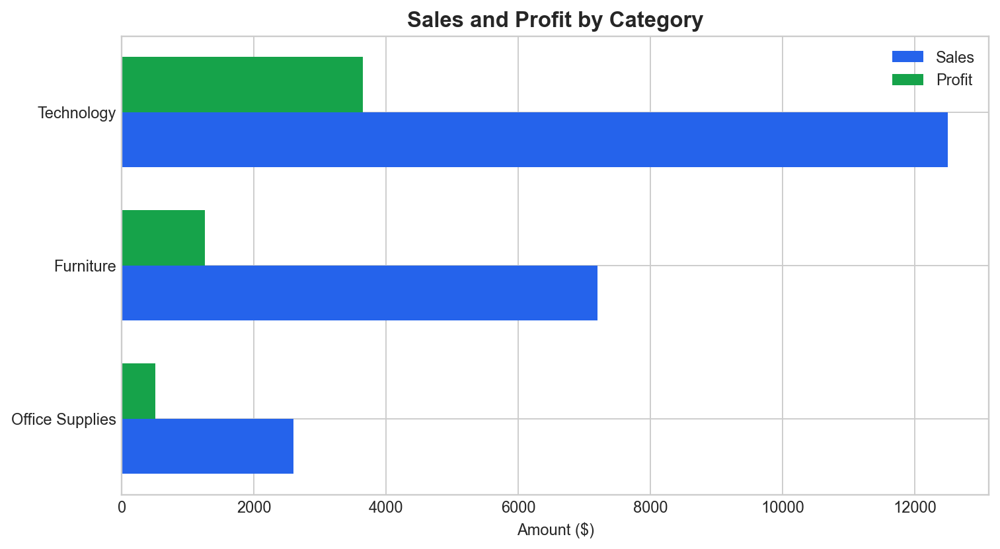
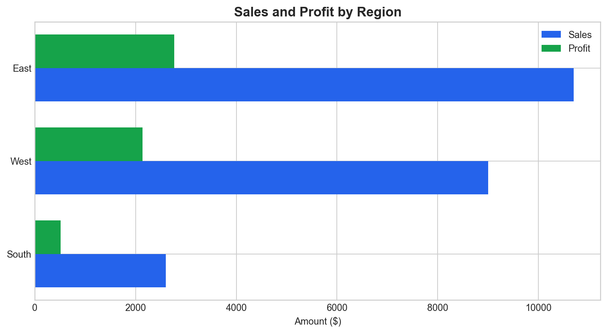
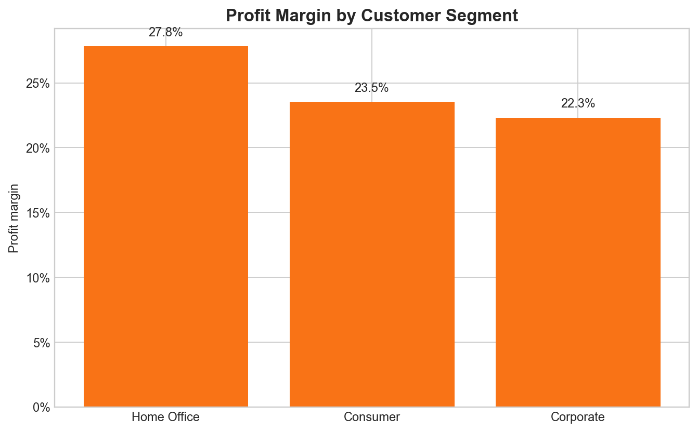
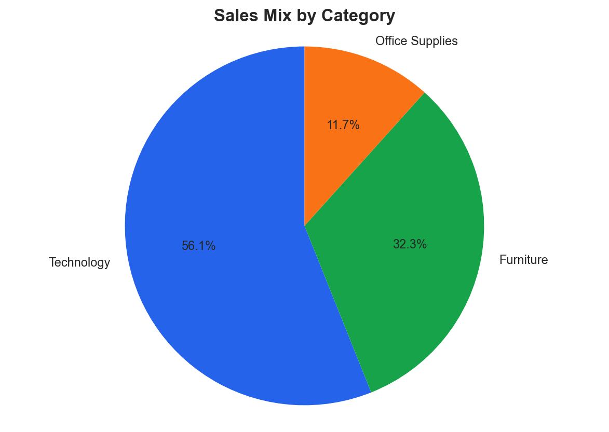

# Retail Sales Report

- Source file: `retail_sales.csv`
- Date range: 2026-01-01 to 2026-01-20
- Generated at: 2026-05-27 09:49

## Executive KPIs

| KPI | Value |
|---|---:|
| Orders | 20 |
| Total Sales | $22,300 |
| Total Profit | $5,420 |
| Profit Margin | 24.3% |
| Average Order Value | $1,115 |
| Best Region | East |
| Best Category | Technology |
| Best Segment | Consumer |

## Insights

- Total sales reached $22,300 across 20 orders; profit reached $5,420, equal to a 24.3% profit margin.
- The Technology category is the primary driver: $12,500 in sales (56.1% of total sales) and $3,650 in profit.
- The East region leads with $10,700 in sales and $2,770 in profit. South is the weakest region, with $2,600 in sales and a 19.6% profit margin.
- The Consumer segment generates the most sales ($8,800); Home Office has the strongest profit margin at 27.8%.
- Sales in the final 5 days were 48.5% higher than the first 5 days; profit rose 75.7%, indicating stronger sales momentum late in the period.
- Furniture has the lowest profit margin (17.5%); review pricing, discounts, or product mix.

## Recommendations

- Prioritize sales budget for Technology because it contributes the most sales and profit.
- Optimize Furniture through bundles, pricing adjustments, or cost reductions to bring margin closer to the overall level.
- Replicate the East playbook in South: winning categories, promotions, and customer care scripts.
- Expand the Home Office customer base because it is the highest-margin segment.
- Add Quantity, Unit Cost, Discount, and Channel to the raw data for deeper margin and campaign effectiveness analysis.

## Visualizations

## Performance by Category

| Category | Orders | Sales | Profit | ProfitMargin | SalesShare | ProfitShare |
| --- | ---: | ---: | ---: | ---: | ---: | ---: |
| Technology | 7 | $12,500 | $3,650 | 29.2% | 56.1% | 67.3% |
| Furniture | 7 | $7,200 | $1,260 | 17.5% | 32.3% | 23.2% |
| Office Supplies | 6 | $2,600 | $510 | 19.6% | 11.7% | 9.4% |

## Performance by Region

| Region | Orders | Sales | Profit | ProfitMargin | SalesShare | ProfitShare |
| --- | ---: | ---: | ---: | ---: | ---: | ---: |
| East | 7 | $10,700 | $2,770 | 25.9% | 48.0% | 51.1% |
| West | 7 | $9,000 | $2,140 | 23.8% | 40.4% | 39.5% |
| South | 6 | $2,600 | $510 | 19.6% | 11.7% | 9.4% |

## Performance by Segment

| CustomerSegment | Orders | Sales | Profit | ProfitMargin | SalesShare | ProfitShare |
| --- | ---: | ---: | ---: | ---: | ---: | ---: |
| Consumer | 8 | $8,800 | $2,070 | 23.5% | 39.5% | 38.2% |
| Corporate | 7 | $7,350 | $1,640 | 22.3% | 33.0% | 30.3% |
| Home Office | 5 | $6,150 | $1,710 | 27.8% | 27.6% | 31.5% |
